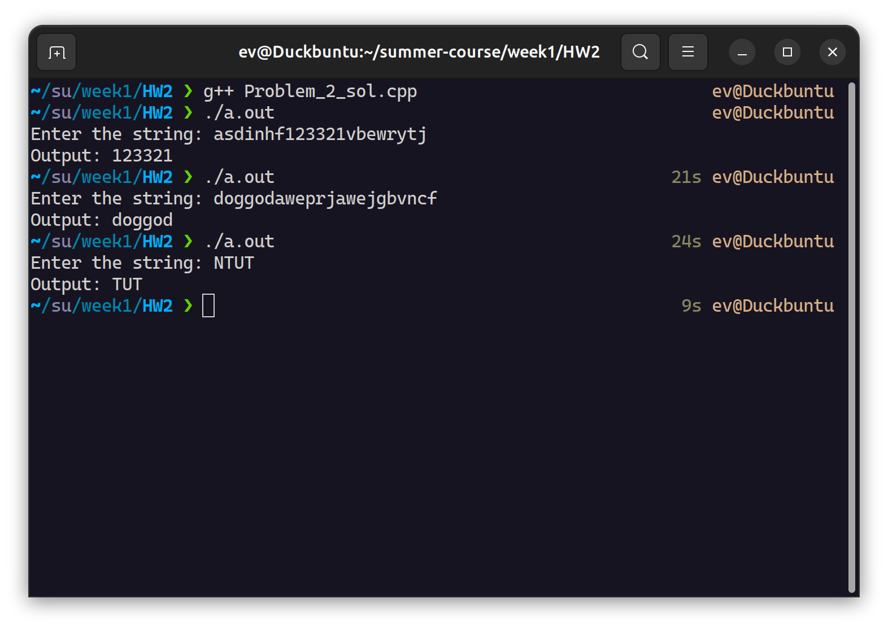

# Problem 2

> 這是我使用命令行作為 I/O 界面編寫的版本。若需查看 LeetCode 格式（作為函數被調用）的程式碼，可以在 /week1/HW2/leetcode_version 目錄下找到。

### Description
Given a string s, return the longest palindromic substring in s.

### Explanation
我將迴文的對稱方式根據字數的奇偶分為兩種：
#### 1. 偶對稱
迴文字數為偶數，中間點在一個對子中間，如 aa, baab。
所有偶對稱組合的最小結構都是中心的一個對子，因此我以遍歷的方式在陣列中比較當前字元與下一個字元是否相同，若是相同則再對該對子左右兩旁的字元進行比較，若是相同則擴增剛才找到的迴文，不同則繼續對陣列的下一個字元進行上述操作，如此便能找出這段字串裡最長的偶對稱回文。

#### 2. 奇對稱
迴文字數為奇數，中間點是一個字元，如 aaa, baaab。
所有奇對稱組合的最小結構都是中心的一個字元，因此我以遍歷的方式在陣列中比較當前字元與前後兩個字元是否相同，若是相同則再對該迴文左右兩旁的字元進行比較，若是相同則增長，不同則繼續對陣列的下一個字元進行上述操作，如此便能找出這段字串裡最長的奇對稱回文。

### Time Complexity
假設字串的總字數為 n，遍歷字串中所有的字元的複雜度為 O(n)，每次調用 Even() 和 Odd() 檢查迴文的最壞情況須檢查 n/2 次，複雜度也是 O(n)，因此整個程式的時間複雜度為 O(n^2)。

### How to run my code

編譯並執行後，在命令行界面輸入需要找迴文的字串，程式會輸出最長的迴文在命令行界面上。

