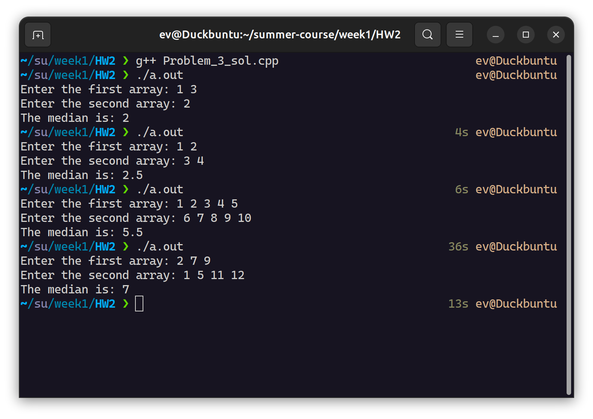

# Problem 3

> 這是使用命令行作為 I/O 界面編寫的版本。若需查看 LeetCode 格式（作為函數被調用）的程式碼，可以在 /week1/HW2/leetcode_version 目錄下找到。

### Description
Given two sorted arrays nums1 and nums2 of size m and n respectively, return the median of the two sorted arrays.
The overall run time complexity should be O(log (m+n)).

### Explanation
看到複雜度要求要 O(log(m+n))，我第一個想法就是用 binary search 的方式，想辦法在不合併兩個陣列的情況下找出中位數，然而思考了許久還是想不出具體的解法。

雖然達不到 O(log(m+n)) 的複雜度，但我還是想出了個 O(m+n) 的方法，下面是我的程式說明：

計算岀中位數在兩陣列依大小排序後的位置（僅計算索引值 (m+n+1)/2，並未排序），排除空陣列的 edge cases，對兩陣列從最小值開始逐一比較，直到找到前面計算出的中位數索引值的內容（偶數情況在我的程式為與前一項和的平均數）。

### Time Complexity

總共需進行 (m+n) / 2 次比較，時間複雜度是 O(m+n)。

### How to run my code

編譯並執行後，在命令行界面輸入要處理的兩個陣列，便會輸出結果在命令行界面上。



<details>
  <summary><bold>（補充內容）網路上查到的 O(log min(m, n)) 解法</bold></summary>
  <br/>

下面的程式碼來自這個連結裡的影片內容。  
https://leetcode.cn/problems/median-of-two-sorted-arrays/solutions/258842/xun-zhao-liang-ge-you-xu-shu-zu-de-zhong-wei-s-114/

這位作者定義了一個虛擬的分隔線，使兩個陣列各被切割為左右兩部份，將被切割出來的兩陣列左半部份視為一個集合，右半部份視為另一個集合，兩個集合的元素數量相等（奇數時定義為左集合多 1），且右半部份的所有元素都大於左半部份。

而找出這個分隔線的方法事先將分隔線設在中間，再透過分隔線左邊的最大數值必須小於右邊最小值這個條件不斷對分隔線進行調整（每次調整都是用 binary search 的方式），直到找出符合條件的正確分隔線。

找到這條分隔線後，若所有元素的總數為奇數，則中位數是左集合最大的數，若元素總數為偶數，則中位數是左集合最大數及右集合最小數的平均值。

### Time Complexity

只需在較短的陣列中進行 binary search，故時間複雜度為 O(log min(m, n))。

```cpp
#include <iostream>
#include <vector>
#include <climits>
#include <cmath>

using namespace std;

class Solution {
public:
    double findMedianSortedArrays(vector<int>& nums1, vector<int>& nums2) {
        if (nums1.size() > nums2.size())
            return findMedianSortedArrays(nums2, nums1);

        int m = nums1.size();
        int n = nums2.size();
        int totalLeft = (m+n+1)/2;
        int left = 0;
        int right = m;

        while(left < right)
        {
            int i = left + (right - left + 1)/2;
            int j = totalLeft - i;
            if(nums1[i-1] > nums2[j])
                right = i-1;
            else
                left = i;
        }

        int i = left;
        int j = totalLeft - i;
        int nums1LeftMax = (i == 0) ? INT_MIN : nums1[i-1];
        int nums1RightMin = (i == m) ? INT_MAX : nums1[i];
        int nums2LeftMax = (j == 0) ? INT_MIN : nums2[j-1];
        int nums2RightMin = (j == n) ? INT_MAX : nums2[j];

        if((m + n) % 2 == 1)
            return max(nums1LeftMax, nums2LeftMax);
        else
            return (double) (max(nums1LeftMax, nums2LeftMax) + min(nums1RightMin, nums2RightMin))/2.0;
    }
};
```
</details>