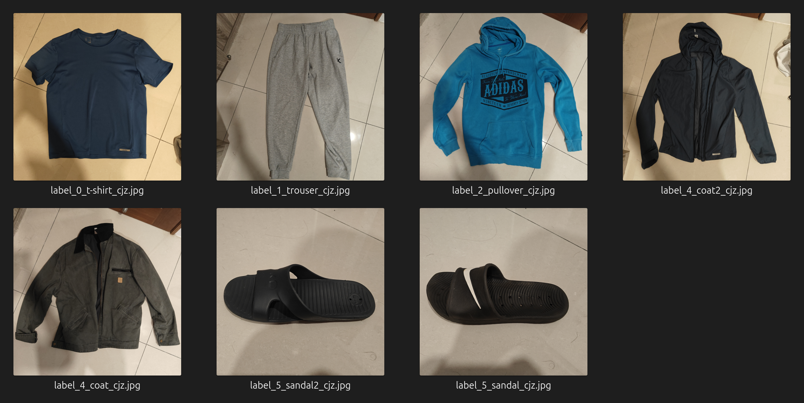
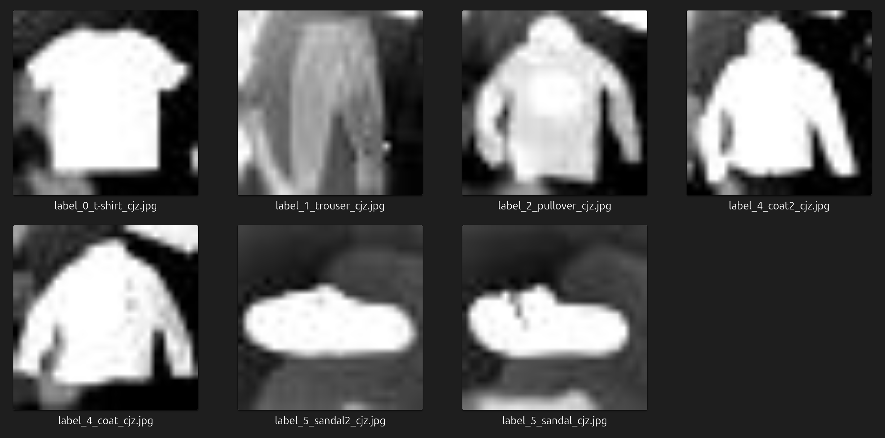

# Week 2 homework
Please train a model with PyTorch to classify Fashion MNIST dataset, and submit your source code for training, your best model, and the screenshot of the training log (not required if your jupyter notebook contains the training log).

Your source code must contain custom dataset, data normalization, data augmentation, loss & accuracy calculations on training / validation / testing set.
  
Deadline: 2024/08/13 23:59:59

>fashion-mnist_train.csv 及 fashion-mnist_test.csv 須自行下載後放置到 fashion 目錄下：  
https://www.kaggle.com/datasets/zalando-research/fashionmnist

---

### 我自己額外加入的訓練資料

我拍了幾張自己的衣服、褲子還有拖鞋的照片，雖然不夠 fashion 但我還是把它們加進了這次的訓練資料集中。

轉換前：

轉換後：

